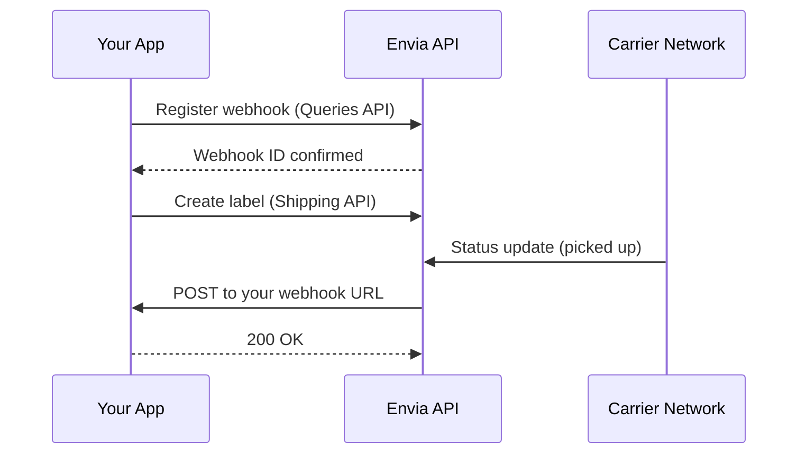

---

updatedAt: 2026-08-18T17:32:46.000Z
---

Fetch the complete documentation index at: https://docs.envia.com/llms.txt. Use this file to discover all available pages before exploring further. Append .md to any documentation page URL to get its markdown version.

# Webhooks Guide

Webhooks push event data to your server the moment something happens — a label is created, a package is delivered, or a tracking status changes. This eliminates the need to poll the tracking endpoint repeatedly.

## How it works



## Step 1 — List available webhook types

Before registering, check which event types are available.

<Tabs>
  <Tab title="cURL">
    ```bash
    curl --request GET \
      --url https://queries-test.envia.com/webhook-types \
      --header "Authorization: Bearer $ENVIA_SANDBOX_TOKEN"
    ```
  </Tab>

  <Tab title="JavaScript">
    ```javascript
    const response = await fetch("https://queries-test.envia.com/webhook-types", {
      headers: {
        Authorization: `Bearer ${process.env.ENVIA_SANDBOX_TOKEN}`,
      },
    });
    const types = await response.json();
    console.log(types);
    ```
  </Tab>

  <Tab title="Python">
    ```python
    import os, requests

    response = requests.get(
        "https://queries-test.envia.com/webhook-types",
        headers={"Authorization": f"Bearer {os.environ['ENVIA_SANDBOX_TOKEN']}"},
    )
    print(response.json())
    ```

  </Tab>
</Tabs>

The response returns an array of webhook types, each with an `id`, `name`, and `description`. Use the `id` value as the `type_id` when creating a webhook in the next step.

<Callout icon="💡" theme="default">
  **Tip:** The tracking status update webhook is the most commonly used type. It replaces the need to poll `POST /ship/generaltrack/`.
</Callout>

## Step 2 — Register a webhook

Register your HTTPS endpoint for the event type you want to receive.

<Tabs>
  <Tab title="cURL">
    ```bash
    curl --request POST \
      --url https://queries-test.envia.com/webhooks \
      --header "Authorization: Bearer $ENVIA_SANDBOX_TOKEN" \
      --header "Content-Type: application/json" \
      --data '{
        "type_id": 3,
        "url": "https://your-app.com/webhooks/envia",
        "active": 1
      }'
    ```
  </Tab>

  <Tab title="JavaScript">
    ```javascript
    const response = await fetch("https://queries-test.envia.com/webhooks", {
      method: "POST",
      headers: {
        Authorization: `Bearer ${process.env.ENVIA_SANDBOX_TOKEN}`,
        "Content-Type": "application/json",
      },
      body: JSON.stringify({
        type_id: 3,
        url: "https://your-app.com/webhooks/envia",
        active: 1,
      }),
    });
    console.log(await response.json());
    ```
  </Tab>

  <Tab title="Python">
    ```python
    import os, requests

    response = requests.post(
        "https://queries-test.envia.com/webhooks",
        headers={"Authorization": f"Bearer {os.environ['ENVIA_SANDBOX_TOKEN']}"},
        json={"type_id": 3, "url": "https://your-app.com/webhooks/envia", "active": 1},
    )
    print(response.json())
    ```

  </Tab>
</Tabs>

### Response

The response includes a `meta` field set to `"webhook_created"` and a `data` object with the webhook details:

```json
{
  "meta": "webhook_created",
  "data": {
    "id": 4421,
    "type": "...",
    "url": "https://your-app.com/webhooks/envia",
    "active": 1
  }
}
```

Save the `data.id` — you need it to update, deactivate, or test the webhook later.

## Step 3 — Handle incoming events

When an event fires, Envia sends an HTTP POST to your registered URL with a JSON payload. The structure varies by event type — see the sections below for the full payload shape of each type.

### Tracking webhook payload (`type_id: 3`)

The tracking webhook fires when a shipment status changes (picked up, in transit, delivered, etc.).

```json
{
  "type": "tracking.simple",
  "created_at": "2025-11-12T14:23:05.000Z",
  "data": {
    "shipment_id": 98765,
    "tracking_number": "1Z999AA10123456784",
    "carrier_name": "UPS",
    "status": "delivered",
    "status_description": "Package delivered to recipient",
    "location": "Mexico City, MX"
  }
}
```

### Surcharge webhook payload (`type_id: 5`)

The surcharge webhook fires when an extra charge is applied to a shipment (e.g. overweight, return to origin) or when a charge is refunded.

```json
{
  "type": "surcharge",
  "created_at": "2025-11-12T14:23:05.000Z",
  "data": {
    "surcharge_id": 12345,
    "shipment_id": 98765,
    "tracking_number": "1Z999AA10123456784",
    "carrier_name": "UPS",
    "surcharge_data": {
      "surcharge_type": "Overweight",
      "reason": "Package exceeds declared weight limit",
      "amount": 85.5,
      "currency": "MXN",
      "transaction_type": "surcharge"
    }
  }
}
```

**Field reference:**

| Field              | Description                                                              |
| ------------------ | ------------------------------------------------------------------------ |
| `surcharge_type`   | Category of the charge (e.g. `Overweight`, `Return to Origin`, `Po Box`) |
| `transaction_type` | `"surcharge"` = charge applied · `"refund"` = charge reversed            |
| `amount`           | Always a positive number — use `transaction_type` to determine direction |
| `currency`         | ISO 4217 code (e.g. `MXN`, `USD`, `COP`)                                 |

**Refund example** — same structure, `transaction_type` is `"refund"`:

```json
{
  "type": "surcharge",
  "created_at": "2025-11-13T09:10:00.000Z",
  "data": {
    "surcharge_id": 12350,
    "shipment_id": 98765,
    "tracking_number": "1Z999AA10123456784",
    "carrier_name": "UPS",
    "surcharge_data": {
      "surcharge_type": "Overweight",
      "reason": "",
      "amount": 85.5,
      "currency": "MXN",
      "transaction_type": "refund"
    }
  }
}
```

### Request headers

The headers included depend on the webhook **type**:

- **Signed types** — `tracking.simple` (`type_id: 3`), `ecommerceTracking` (`type_id: 4`), and `surcharge` (`type_id: 5`) — include the full signed header set:

  | Header                | Description                                                                  |
  | --------------------- | ---------------------------------------------------------------------------- |
  | `X-Webhook-Event`     | Event type (e.g. `surcharge`, `tracking.simple`)                             |
  | `X-Webhook-Version`   | API version date (e.g. `2025-09-01`)                                         |
  | `X-Webhook-Id`        | Unique delivery ID for deduplication                                         |
  | `X-Webhook-Timestamp` | Unix timestamp in milliseconds                                               |
  | `X-Webhook-Signature` | HMAC-SHA256 signature: `v1=HMAC(ts + "." + event + "." + body_json, secret)` |
  | `Authorization`       | `Bearer <your-auth-token>` if configured                                     |

- **Legacy types** — `onShipmentStatusUpdate` (`type_id: 1`) and `statusUpdateWithEcommerceInfo` (`type_id: 2`) — only send:

  | Header          | Description                              |
  | --------------- | ---------------------------------------- |
  | `Authorization` | `Bearer <your-auth-token>` if configured |

  These legacy types never include `X-Webhook-Signature` or the other `X-Webhook-*` headers.

<Callout icon="⚠️" theme="default">
  **Important:** If you need to verify requests with `X-Webhook-Signature`, register a **signed type** (`tracking.simple`, `ecommerceTracking`, or `surcharge`). Legacy types cannot be verified this way — always verify the signature when it's present, before processing.
</Callout>

### Receiver implementation

Your endpoint must respond with a `2xx` status quickly. Process the payload asynchronously to avoid timeouts.

<Tabs>
  <Tab title="JavaScript (Express)">
    ```javascript
    app.post("/webhooks/envia", (req, res) => {
      // Respond immediately
      res.status(200).json({ received: true });

      // Process asynchronously
      const payload = req.body;
      console.log("Webhook received:", JSON.stringify(payload));

      // Update your database, notify customers, etc.
      processWebhookEvent(payload).catch(console.error);
    });
    ```

  </Tab>

  <Tab title="Python (Flask)">
    ```python
    from flask import Flask, request, jsonify
    import threading

    app = Flask(__name__)

    @app.route("/webhooks/envia", methods=["POST"])
    def handle_webhook():
        payload = request.json

        # Process asynchronously
        thread = threading.Thread(target=process_event, args=(payload,))
        thread.start()

        # Respond immediately
        return jsonify({"received": True}), 200

    def process_event(payload):
        print(f"Webhook received: {payload}")
        # Update your database, notify customers, etc.
    ```

  </Tab>
</Tabs>

## Step 4 — Test your webhook

Use the Test Webhook endpoint to send a test event to your URL without waiting for a real carrier event.

```bash
curl --request POST \
  --url https://api-test.envia.com/ship/webhooktest/ \
  --header "Authorization: Bearer $ENVIA_SANDBOX_TOKEN" \
  --header "Content-Type: application/json" \
  --data '{
    "tracking_number": "7520610403",
    "webhook_url": "https://your-app.com/webhooks/envia"
  }'
```

The test endpoint sends a sample payload to the specified `webhook_url` using the given `tracking_number`. Check your server logs to confirm the payload arrived.

<Callout icon="⚠️" theme="default">
  **Note:** This test endpoint always sends only `Content-Type` and `Authorization` — it never includes `X-Webhook-Signature` or the other `X-Webhook-*` headers, even for signed types. To validate signature verification, trigger a real tracking event on a **signed type** webhook (`tracking.simple`, `ecommerceTracking`, or `surcharge`) instead.
</Callout>

## Managing webhooks

### List your webhooks

```bash
curl --request GET \
  --url https://queries-test.envia.com/webhooks \
  --header "Authorization: Bearer $ENVIA_SANDBOX_TOKEN"
```

### Update a webhook

```bash
curl --request PUT \
  --url https://queries-test.envia.com/webhooks/4421 \
  --header "Authorization: Bearer $ENVIA_SANDBOX_TOKEN" \
  --header "Content-Type: application/json" \
  --data '{"url": "https://your-app.com/webhooks/envia-v2", "active": 1}'
```

### Deactivate a webhook

Set `active` to `0` to pause deliveries without deleting the webhook:

```bash
curl --request PUT \
  --url https://queries-test.envia.com/webhooks/4421 \
  --header "Authorization: Bearer $ENVIA_SANDBOX_TOKEN" \
  --header "Content-Type: application/json" \
  --data '{"active": 0}'
```

## Production checklist

Before going live with webhooks, verify:

- [ ] Endpoint is publicly reachable via **HTTPS**
- [ ] Responds with `2xx` within **5 seconds**
- [ ] Processes payloads **asynchronously** (don't block the response)
- [ ] Handles **duplicate deliveries** with idempotency (use a unique key from the payload to deduplicate)
- [ ] Uses **separate webhook URLs** for sandbox and production
- [ ] Tested using the **Test Webhook** endpoint
- [ ] Logs all incoming events for debugging

## Troubleshooting

<Accordion title="Webhook events are not arriving">
  1. Check that your URL is publicly accessible (not `localhost`).
  2. Verify the webhook is `active: 1` with `GET /webhooks`.
  3. Test manually with the Test Webhook endpoint.
  4. Confirm your firewall/proxy allows POST requests from Envia's servers.
</Accordion>

<Accordion title="Receiving duplicate events">
  Implement idempotency by tracking processed events. Use a combination of fields from the payload as a unique key. If you've already processed that combination, skip it.
</Accordion>

<Accordion title="Webhook endpoint timing out">
  Return `200 OK` immediately and process the payload in a background job or queue. Do not make external API calls before responding.
</Accordion>

<Callout icon="📚" theme="default">
  **Related pages:**
  * [Integration Guide — Phase 5](https://docs.envia.com/docs/integration-guide) — Webhooks in the integration flow
  * [Common Queries Endpoints](https://docs.envia.com/docs/common-queries-endpoints) — Webhook management endpoints
  * [Error Response Formats](https://docs.envia.com/docs/error-codes) — How each API returns errors
  * [Production Readiness Checklist](https://docs.envia.com/docs/production-checklist) — Go-live checklist
</Callout>
